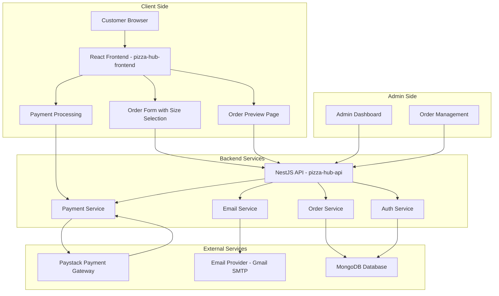
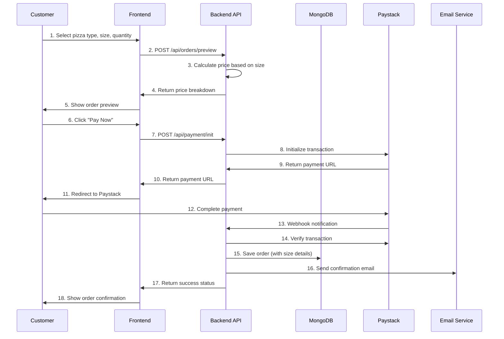
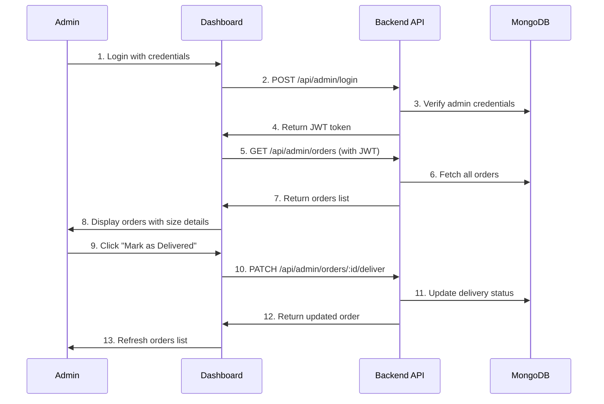
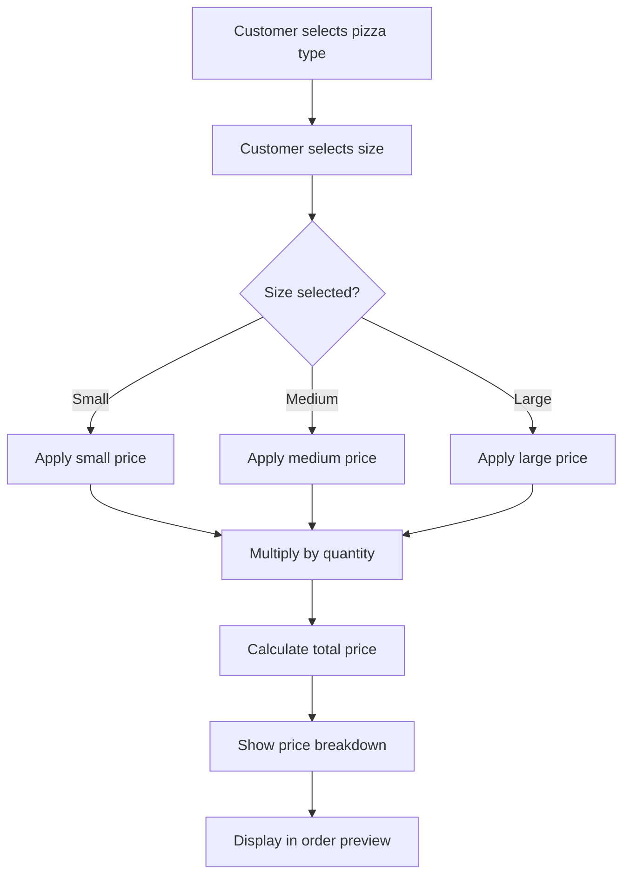
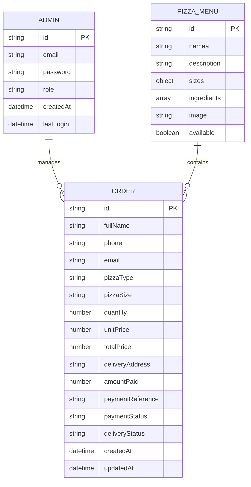
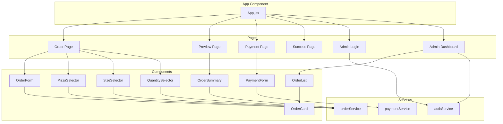
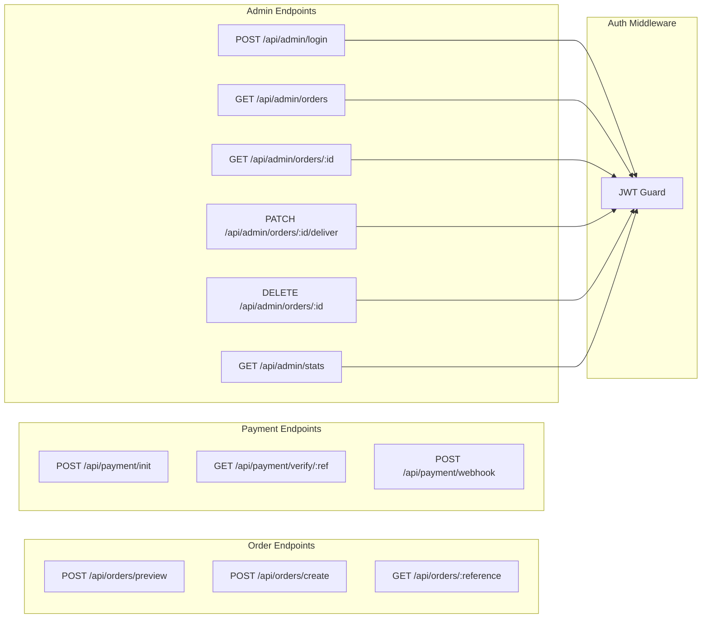

# Pizza Hub - System Flow Diagrams

## Overall System Architecture

## Customer Order Flow

## Admin Order Management Flow

## Pizza Size Pricing Logic Flow

## Database Schema Relationships

## Component Architecture (Frontend)

## API Endpoint Structure

These diagrams provide a comprehensive visual representation of the pizza ordering system, including the enhanced pizza size feature and the updated project structure with Tailwind CSS styling.